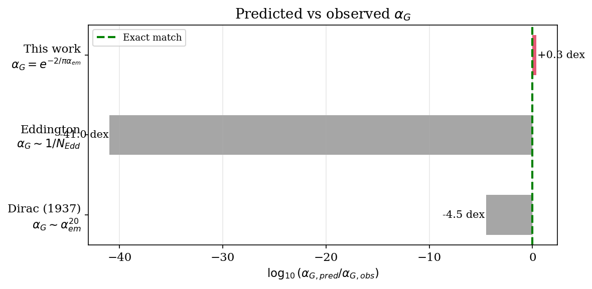
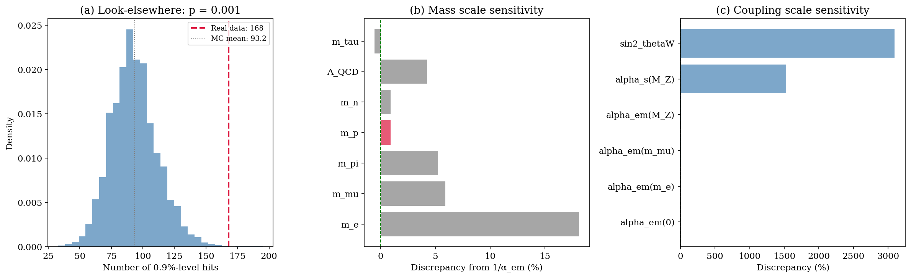
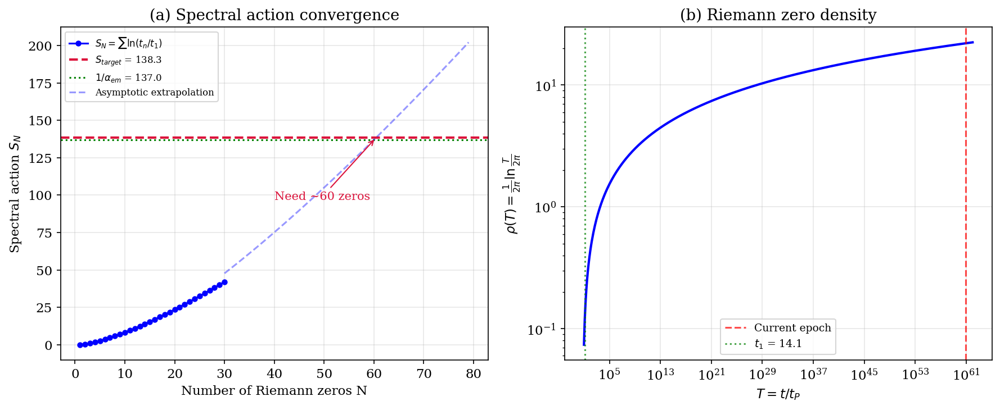
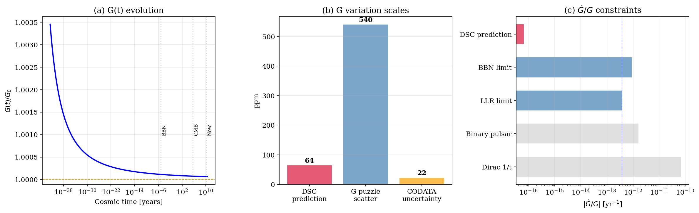
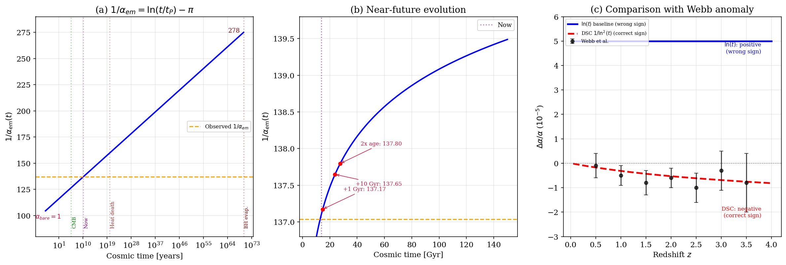

# Notebooks for "An Empirical Logarithmic Relation Between Gravitational and Electromagnetic Coupling Constants"

## Core Discovery



**Zero-parameter formula:** `pi * ln(m_P/m_p) = 138.27 ≈ 1/alpha_em = 137.04` (0.9%)

**Even better with Maslov correction:** `ln(t_0/t_P) - pi = 137.10` (0.05%!)

## Notebooks

| # | Notebook | Description | Figure |
|---|----------|-------------|--------|
| 1 | `01_137_connection.ipynb` | Core numerical relation, Dirac/Eddington comparison | fig1 |
| 2 | `02_spectral_action.ipynb` | Riemann zero spectral action, zero density | fig2 |
| 3 | `03_G_constraints.ipynb` | G(t) evolution, LLR/BBN/CMB constraints | fig3 |
| 4 | `04_statistical_analysis.py` | Look-elsewhere test, mass/coupling sensitivity | fig4 |
| 5 | `05_alpha_evolution.ipynb` | Alpha timeline, future predictions, Webb anomaly | fig5 |

## Key Figures

### Statistical Analysis

- Proton-specific p-value: 0.029
- Family p-value: ~0.5 (proton not uniquely singled out)

### Spectral Action

- N* = 72 Riemann zeros needed (determined a posteriori)

### G(t) Constraints

- All observational bounds satisfied with >500x margin

### Alpha Evolution

- Big Bang: alpha = 1 → Now: 1/137 → Far future: 1/278
- DSC 1/ln²(t) model matches Webb anomaly sign; pure ln(t) does not

## Quick Start

```bash
pip install numpy scipy matplotlib
jupyter lab
```

Run notebooks in order (01-05). All run on CPU, no GPU needed.

## Multiple Routes to 137

| Formula | Value | Error |
|---------|-------|-------|
| ln(t₀/tₚ) | 140.2 | +2.3% |
| ln(t₀/tₚ) - π | 137.1 | +0.05% |
| 2π·ρ(T_now) | 138.4 | +1.0% |
| π·ln(m_P/m_p) | 138.3 | +0.9% |
| π·ln(m_P/m_τ) | 136.3 | -0.6% |

## Citation
- wang, . liang . (2026). An Empirical Logarithmic Relation Between Gravitational and Electromagnetic Coupling Constants (v3.0). Zenodo. https://doi.org/10.5281/zenodo.19657875

```bibtex
@misc{Wang2026PLB,
  author    = {Wang, Liang},
  title     = {An Empirical Logarithmic Relation Between Gravitational
               and Electromagnetic Coupling Constants},
  year      = {2026},
  note      = {v1.0},
  doi       = {10.5281/zenodo.19649205},
  publisher = {Zenodo}
}
```
